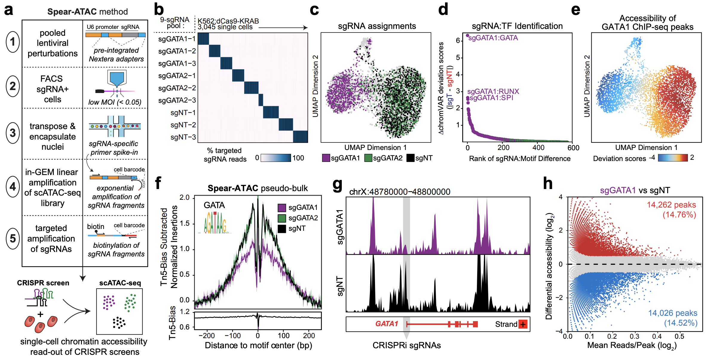

# High-throughput single-cell chromatin accessibility CRISPR screens enable unbiased identification of regulatory networks in cancer (Pierce SE*, Granja JM*, et al. 2020)

## **Link** : https://www.biorxiv.org/content/10.1101/2020.11.02.364265v1

## Please cite : Pierce SE et al., High-throughput single-cell chromatin accessibility CRISPR screens enable unbiased identification of regulatory networks in cancer. bioRxiv (2020)  

# sgRNA Align Barcodes (See AlignSgRNA Folder)

## Scripts (See Scripts Folder)

**RunSnakemake.sh** - Bash executable to run snakemake analysis (bash RunSnakemake.sh)

**Snake-Align-sgRNA.py** - Snakemake for sgRNA Align Analysis.

**SpearATAC-Align-sgRNA.R** - Code for analysis of SpearATAC Screen. 

## Data Files (See data Folder)

**10x-Barcodes.txt** - 10x Genomics Cell Barcodes for scATAC-seq  

**K562_Large_1_I2-Downsampled.barcoded.fastq.gz** - Amplified SpearATAC cell barcodes.  
**K562_Large_1_R1-Downsampled.barcoded.fastq.gz** - Amplified SpearATC sgRNA barcodes.  

**sgRNA-K562-Pilot.txt** - sgRNA barcodes for K562 Pilot screen (change in Snake-Align-sgRNA.py)  
**sgRNA-K562-TimeCourse.txt** - sgRNA barcodes for K562 Time Coures screen (change in Snake-Align-sgRNA.py)  
**sgRNA-LargeScreen.txt** - sgRNA barcodes for Large screens (change in Snake-Align-sgRNA.py)  

# Analysis of scATAC + sgRNA data (See AnalyzeSpearATAC Folder)

## Scripts (See Scripts Folder)

**Download-Test-SpearATAC-Data.R - Code for downloading SpearATAC test data.** 

**Analysis-of-Spear-ATAC-Screen.R** - Code for analysis of SpearATAC Screen. 

**SpearATAC-Functions.R** - Helper Functions for SpearATAC Analysis. 

## Data Files (See data Folder)

**K562_R1.fragments.tsv.gz** - 10x Genomics Fragment Files  
**K562_R2.fragments.tsv.gz** - 10x Genomics Fragment Files  

**K562_R1.singlecell.csv** - 10x Genomics Summary Stats containing cells passing filters  
**K562_R1.singlecell.csv** - 10x Genomics Summary Stats containing cells passing filters  

**K562_R1.sgRNA.rds** - SpearATAC sgRNA Files containing Barcode Alignments  
**K562_R2.sgRNA.rds** - SpearATAC sgRNA Files containing Barcode Alignments  

**Vierstra-Human-Motifs.rds** - Motifs from Vierstra et al Nature 2020
